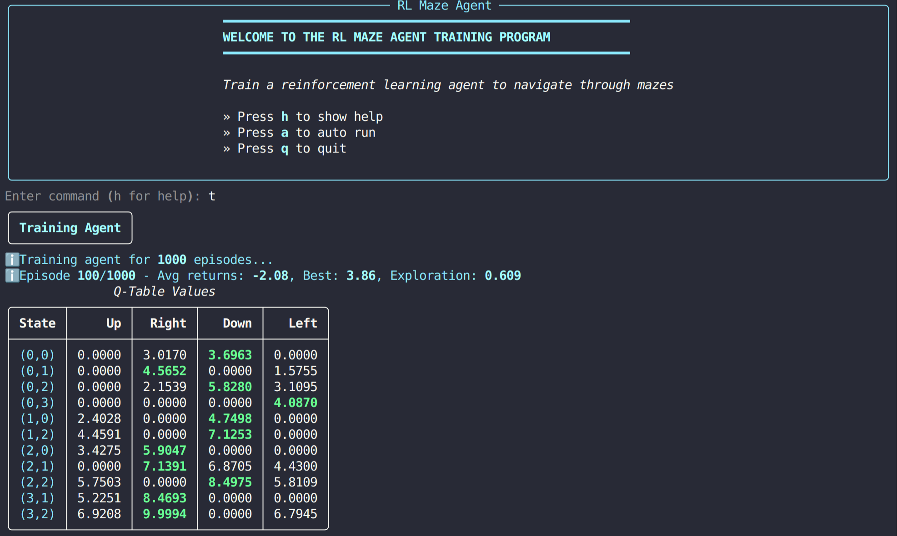
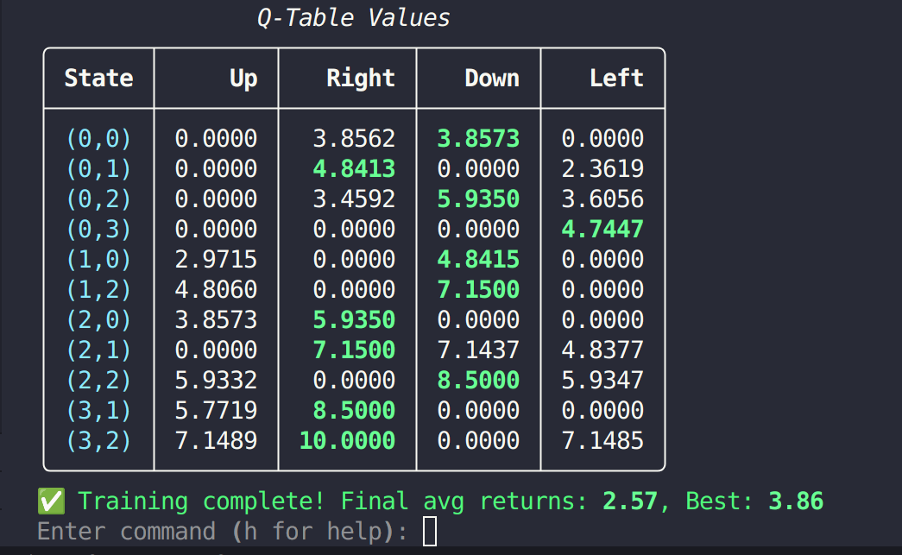

# maze-RL-agent

use RL to train an agent to navigate a simple maze

## usage

```python
python main.py
```

## demo





## task

HUST AI Intro couse lab optional project

> 利用所学强化学习理论知识，编程实现如下所示的智能体走迷宫任务，即从 start 位置出发，到达 goal 位置。

b 0 0 0

0 -1 0 -1

0 0 0 -1

-1 0 0 e

from point b to point e, -1 represents obstacle

## basic analysis

agent: maze-agent, doesn't have prior knowledge, goal is to reach goal point, can't go back to visited point
environment: maze matrix, start point, goal point, obstacles

state: agent pos + maze
action: go left/up/right/down
reward: +10 if arrive at goal point, -1 if hit obstacle

## design

class agent...

class maze...

## file structure

```
├── agent.py # define agent class
├── helper.py # main script, train agent and show result
├── main.py
├── README.md
└── train.py
```

## solution

Q-learning

## result

it just works

not bad cli program

## review

cli programming, interesting
for the most part, I coded by myself
LLM helped a lot in debugging
a lot more to learn
